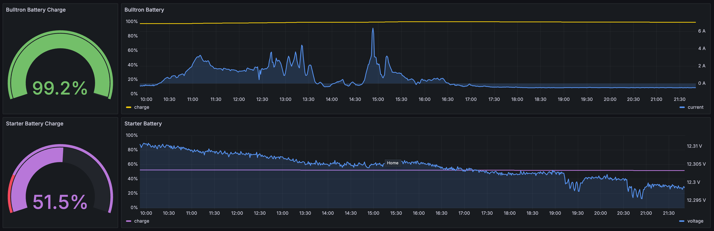

# ESP32 Simarine Sensor Reporter

ESP32 application that connects to Wifi and reports sensor values from Simarine devices
to an MQTT broker to the topic `/sensors/all` as a list of JSON objects. For example:

```json
[
  {
    "sensor_id": 26,
    "value": 0.995
  },
  {
    "sensor_id": 27,
    "value": -0.471793
  }
]
```

## Example Usage

I use this application to report my vans battery state to an AWS Timestream table
so I can monitor it remotely on a Grafana dashboard.



## Requirements

- Wifi Router
- Simarine Pico in STA Wifi mode connected to the Wifi Router
- ESP32 (tested with Espressif ESP32 DevKitC V4)
- [ESP IDF](https://docs.espressif.com/projects/esp-idf) (tested with version 5.2 and 5.3)

## Setup

Create a main/Config.hpp based on main/Config.example.hpp

## Build

Build using `idf.py build` and follow the instructions to flash and use the app.
